# Getting Started with Create React App

This project was bootstrapped with [Create React App](https://github.com/facebook/create-react-app).

## About the Project

Theis is Online Company Project.Using this User can access facilites .

## Technologies Used:

ReactJS, HTML, CSS, JavaScript, Bootstrap

## Screen Shots

### 1.Desktop Version

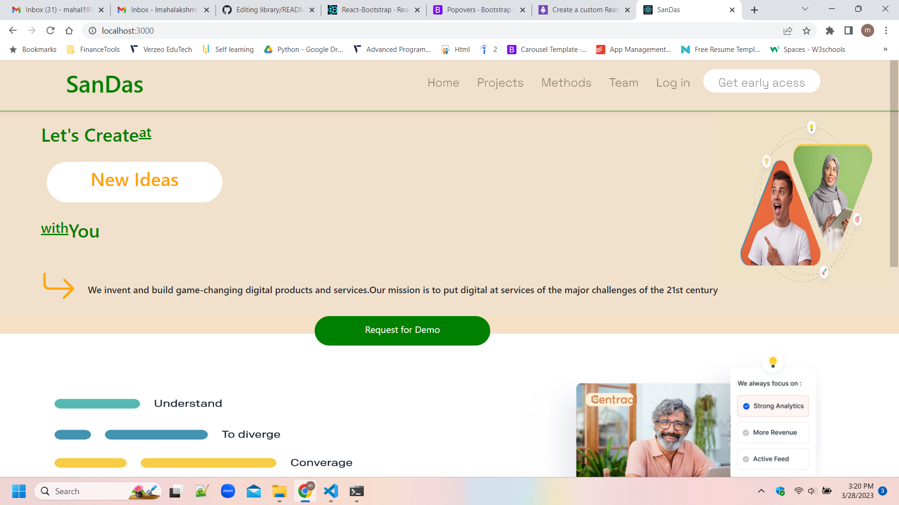
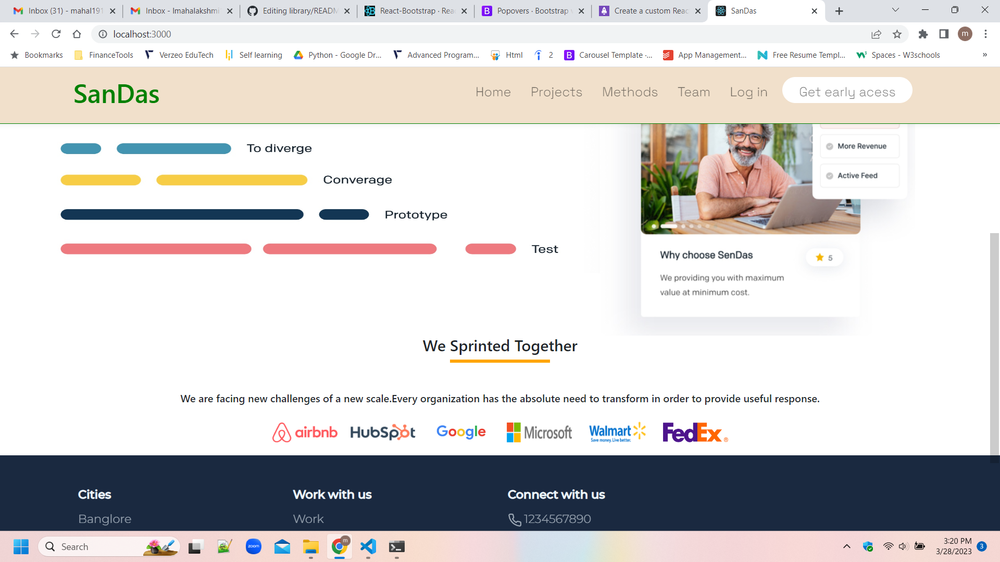
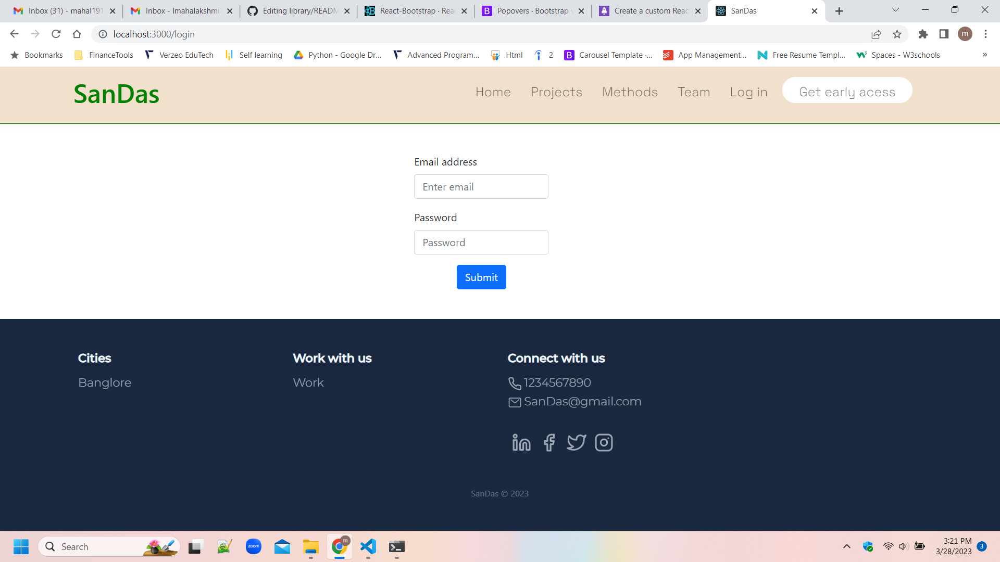
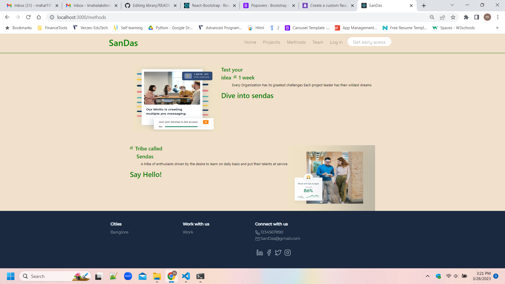
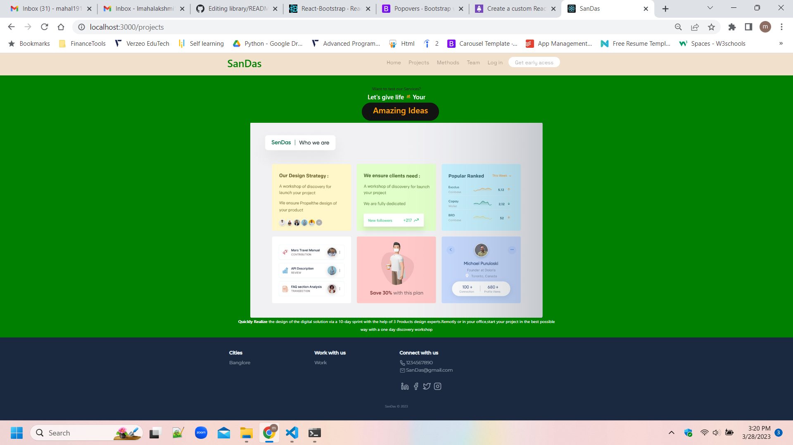
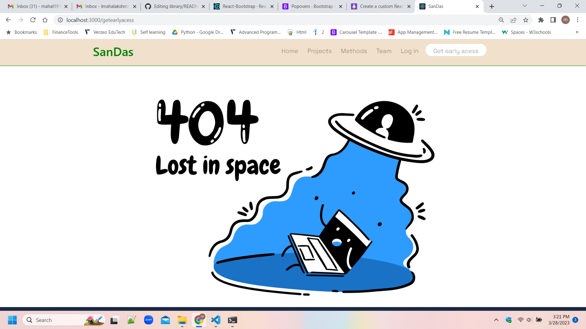

### 2.Mobile Version

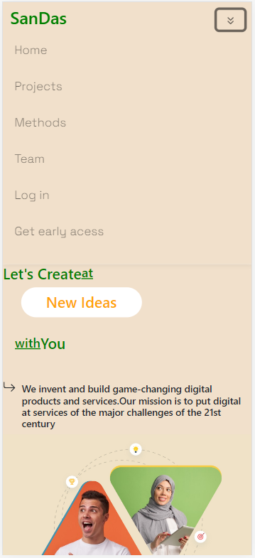
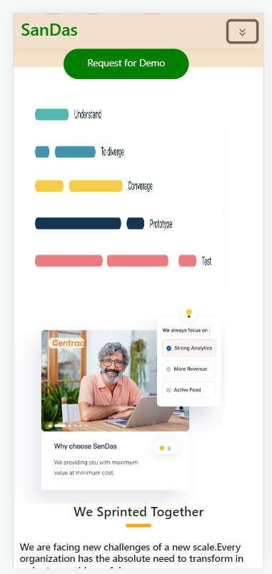
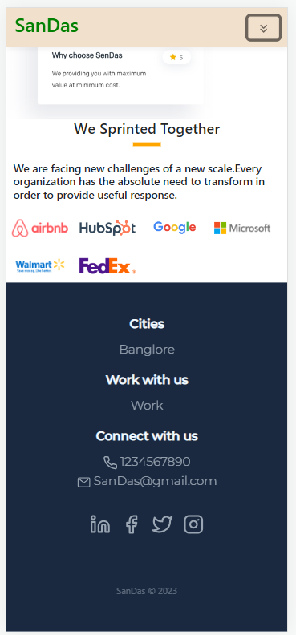
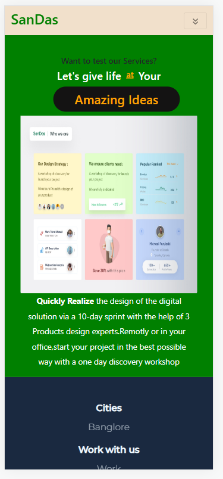
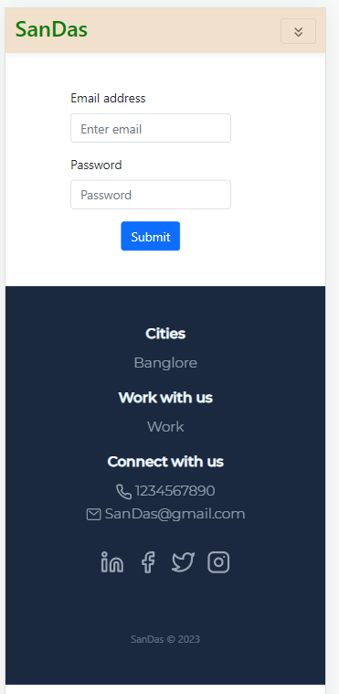
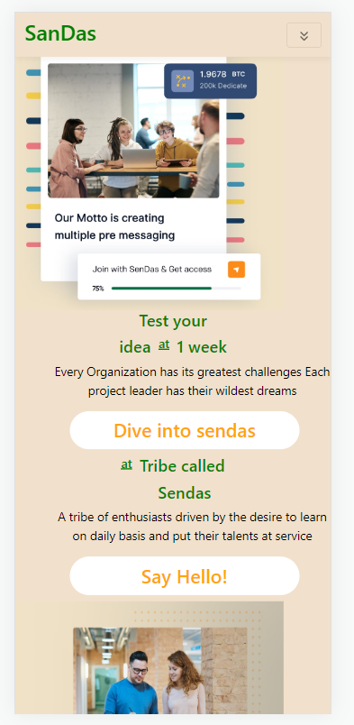
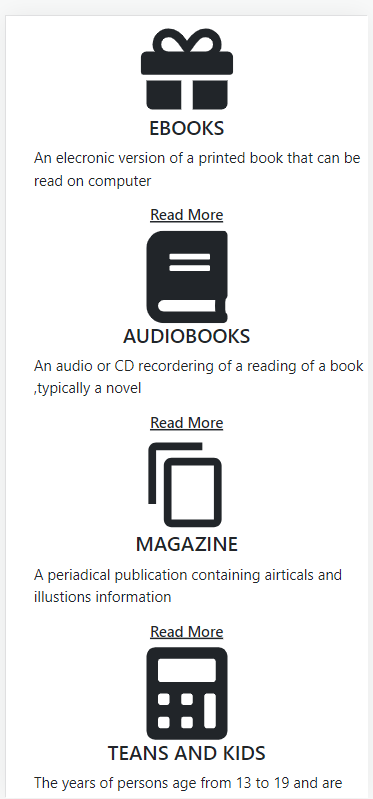

## Running the applicaition

### `clone the repository`

### `npm install`

### `npm start`

Runs the app in the development mode.\
Open [http://localhost:3000](http://localhost:3000) to view it in your browser.
